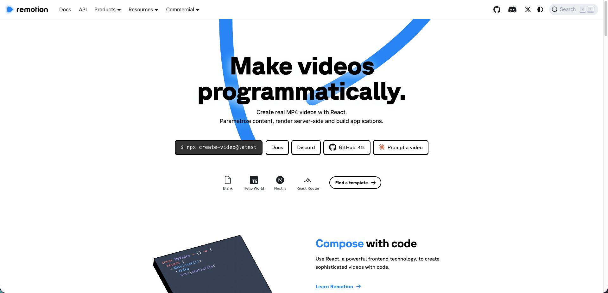

# [INTRO] 따뜻한 크래프트 디자인

B2B인데 장난스럽고, 기업용인데 맛있는 이름의 컬러

---

# [CLAY] Clay Design System

---

# [PALETTE]{1} 맛있는 이름의 컬러 시스템

> Matcha, Slushie, Lemon
> Ube, Pomegranate, Blueberry
> *Dragonfruit*

---

# [PRINCIPLE] 기업용인데 장난스럽다

- Warm Cream 캔버스 위에 Swatch 컬러가 터진다
- 버튼은 호버하면 8도 기울고 점프한다
- 그림자는 블러 대신 하드 오프셋으로 물리감을 준다
- Dashed 보더와 Solid 보더가 공존한다

---

# [COMPONENT] Clay 카드 구조

- 배경은 항상 #ffffff, 캔버스는 Warm Cream
- 보더는 Oat 톤 #dad4c8로 따뜻하게
- 라운딩은 24px 카드, 40px 섹션
- 멀티 레이어 인셋 그림자로 Clay 질감 표현

---

# [RESULT] 도입 성과

$ 120만 [bar:85]
월간 활성 사용자

$ 40% [ring:40]
운영 비용 절감

$ 3.2초 [bar:32]
평균 응답 시간

---

# [INSIGHT] 핵심 메시지

"" 좋은 디자인은 가능한 적게 디자인하는 것이다
— Dieter Rams

---

# [PROCESS] 슬라이드 제작 흐름

1. 발표 주제 선정
2. 마크다운으로 내용 작성
3. 슬라이드 타입 배치
4. 이미지 준비
5. 테마 선택
6. 프레젠터로 미리보기
7. 문장 다듬기
8. 영상으로 렌더링

---

# [VS] 슬라이드 도구 비교

|| 파워포인트
- 범용적이지만 무겁다
- 디자인 자유도 높음
- 영상 렌더링 불가

|| 키노트
- macOS 전용
- 깔끔한 기본 템플릿
- 협업이 어렵다

|| Remotion Slide
- 마크다운으로 작성
- 코드 기반 자동화
- 영상 렌더링 지원

---

# [EVOLUTION] 딱딱한 B2B에서 크래프트 감성으로

<< [기존 B2B]
- 쿨 그레이 배경, 뉴트럴 보더
- 미세한 호버 트랜지션
- 블러 그림자, 날카로운 모서리

==
- Warm Cream 캔버스 도입
- 호버에 회전 + 하드 오프셋 그림자
- 24px~40px 라운딩 + Oat 보더

>> [Clay 방식]
- 따뜻한 크림 위에 Swatch 컬러 폭발
- 버튼이 기울고 튀어오르는 물리적 즐거움
- Dashed + Solid 보더로 핸드메이드 질감
